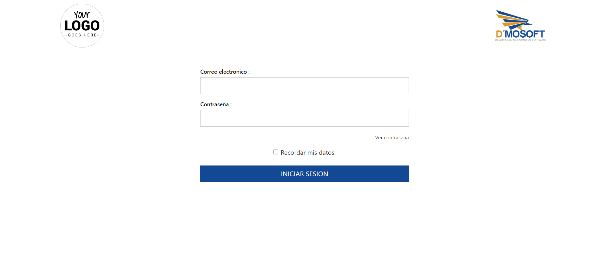

# Login Responsive

Componente de Angular, login (html, css y validaciones del formulario) con bootstrap.

## Vista previa



## Recursos necesarios
* **Bootstrap**

Para facilitar el diseño responsive el login requiere de la instalación de bootstrap. En caso de no querer usar bootstrap el diseño no está optimizado para ser responsive.

Para agregar bootsrap para angular cli al proyecto ejecute el siguiente comando:

```bash
ng add @ng-bootstrap/ng-bootstrap
```

* **Logos**

Los logos que se usan están adjuntos en la carpeta [/assets](https://github.com/B3rert/ng-login/tree/master/src/assets). Estas imagenes pueden variar o en caso de no querer agregarlas al proyecto se omiten.

# Cómo implementar el login 

Siga las siguientes instrucciones para hacer la implementación del login en su proyecto.

## Configuraciones necesarias
Para el uso de formularios en angular es necesario importar **FormsModule**. En el archivo **app.module.ts** de su proyecto, importe.

```typescript
import { FormsModule } from '@angular/forms';
```

El modulo de importaciones debería verse de la siguiente manera:

```typescript
@NgModule({
  declarations: [
    AppComponent,
    LoginComponent,
    LogosComponent,
  ],
  imports: [
    BrowserModule,
    NgbModule,
    FormsModule //Forms Module
  ],
  providers: [],
  bootstrap: [AppComponent]
})
```

# Creación de componentes
Los componentes que se usan están alamacenados en la carpeta [/components](https://github.com/B3rert/ng-login/tree/master/src/app/components).
Los estilos y funciones necesarias para cada componente se encuentran en el archivo correspondiente (.css .html .ts).

## LoginComponent
Este componente contiene todo lo necesario para mostrar el login.

Para crear el componente en angular cli use el siguiente comando:
```bash
ng g c components/login
```

* Archvo HTML 

```html
<div class="container">
    <!--fin logos-->
    <app-logos></app-logos>
    <!--Fin logos-->
    
    <!--Login reponsive-->
    <div class="row">
        <div class="col-md-5 mx-auto text-center">
            <div class="login-right">
                <form #loginForm="ngForm" (ngSubmit)="login()">
                    <div class="sign-in">
                        <h4>Correo electronico :</h4>
                        <input type="text" required [(ngModel)]="nombreInput" name="nombre">
                    </div>
                    <!--inputs-->
                    <div class="sign-in">
                        <h4>Contraseña :</h4>
                        <input *ngIf="!mostrarTexto" type="password" required [(ngModel)]="claveInput" name="clave">
                        <input *ngIf="mostrarTexto" type="text" required [(ngModel)]="claveInput" name="clave" autocomplete="off">
                        <br>
                        <p *ngIf="!mostrarTexto" (click)="this.mostrarTexto = !this.mostrarTexto">Ver contraseña</p>
                        <p *ngIf="mostrarTexto" (click)="this.mostrarTexto = !this.mostrarTexto">Ocultar contraseña</p>
                        <!-- <a>Olvidaste tu contraseña?</a> -->
                        <!-- <a>Registrate</a> -->
                    </div>
                    <!--Fin inputs-->
                    <div class="single-bottom">
                        <input type="checkbox" id="brand" value="" (click)="saveMyData = !saveMyData" checked *ngIf="saveMyData">
                        <input type="checkbox" id="brand" value="" (click)="saveMyData = !saveMyData" *ngIf="!saveMyData">
                        <label for="brand"><span></span>Recordar mis datos.</label>
                    </div>
                    <!--Login btn-->
                    <div class="sign-in">
                        <input type="submit" value="INICIAR SESION">
                    </div>
                </form>
            </div>
        </div>
    <!--Fin Login reponsive-->
    </div>
</div>
```

* Archivo CSS
```css
/*-- login --*/

.login-right {
    margin-top: 10%;
}

.login-right input[type="text"],
.login-right input[type="password"] {
    width      : 100%;
    padding    : 10px;
    font-weight: normal;
    background : none;
    border     : 1px solid #c1bfbf;
    color      : #df9722;
    outline    : none;
    font-size  : 14px;
    margin     : 6px 0 17px 0px;
}

.login-right input[type="text"]:hover,
.login-right input[type="password"]:hover,
.login-right input[type="email"]:hover {
    border: 1px solid #df9722;
}

.login-right h4 {
    text-align: start;
    color     : #000000;
    font-size : 14px;
    margin    : 0 0 0px 0;
}

.login-right input[type="submit"] {
    background        : #134895;
    color             : #fff;
    font-size         : 17px;
    border            : none;
    width             : 100%;
    outline           : none;
    padding           : 8px 15px 9px 15px;
    transition        : 0.5s all;
    -webkit-transition: 0.5s all;
    -moz-transition   : 0.5s all;
    -o-transition     : 0.5s all;
}

.login-right input[type="submit"]:hover {
    background: #df9722;
    color     : #000000;
}

.login-right h3 {
    color        : #df9722;
    font-size    : 22px;
    margin-bottom: 23px;
}

.login-right h6 {
    color        : #df9722;
    font-size    : 15px;
    margin-bottom: 23px;
}

.sign-in a,
p {
    font-size      : 13px;
    color          : rgb(48, 46, 46);
    cursor         : pointer;
    text-decoration: none;
}

.sign-in p {
    text-align: right;
}

.sign-in a:hover {
    color: #df9722;
}

.sign-in p:hover {
    color: #df9722;
}

.single-bottom {
    margin: 14px 0 22px;
}

.single-bottom label {
    margin-left: 5px;
}

.single-bottom label:hover {
    color: #df9722;

}

.single-bottom input,
.single-bottom label {
    cursor: pointer;
}

/*-- //login --*/
```

* Archivo typescript

```typescript
  //input nombre [(ngModel)]
  nombreInput: string = "";
  //input contraseña [(ngModel)]
  claveInput: string = "";
  //check box save data [(ngModel)]
  saveMyData = false;
  //Hiden text password
  mostrarTexto: boolean = false;

  //Function login
  login() {

    //valid void or empty inputs
    if (!this.nombreInput || !this.claveInput) {
      alert ("Por favor completa todos los campos para continuar")
      return
    }

    //Inputs isNotempty
    //Valid user

    if (this.saveMyData) {
      //sesion permanente
    }
    else {
      //sesion no permanente
    }
  }
```

### Validaciones del formulario login (archivo .ts)

* **Variables**

    * **nombreInput:** Contiene el texto que sea ingresado por el input "usuario".
    
    ```typescript
    nombreInput: string = "";
    ```
    
    * **claveInput:** Contiene el texto que sea ingresado por el input "contraseña".
    
    ```typescript
        claveInput: string = "";
    ```

    * **saveMyData:** Controla el cuadro de selección del formulario; verdadero si la sesión será permanente y falso si no lo será.
    
    ```typescript
        saveMyData = false;
    ```
    
    * **mostrarTexto:** Controla si el input "contraseña" es de tipo password o text; Falso para ocultar la contraseña y verdadero para mostrarla.
    
    ```typescript
        mostrarTexto: boolean = false;
    ```

### Validaciones del componete login (HTML)

Dentro del componente login.html se hace el llamdo a <app-logos></app-logos> para mostrar loso logos. Esta linea se puede omitir si no se desean agregar los logos.
  
* **Función login()**

Contiene las validaciones para el formulario, el comportamiento del login deberá estar cofigurado en esta función. 

## LogosComponent

Este componente contiene lo necesario para mostrar dos logos en pantalla y que estos actuen de manera responsive (No necesita bootstrap).

Para crear el componente en angular cli ejecute el siguiente comando:

```bash
ng g c components/logos
```

* Archivo HTML

```html
<div class="container-fluid">
    <div class="row">
        <div class="col">
            <div class="d-flex">
                
                <span class="spacer"></span>
                
            </div>
        </div>
    </div>
</div>
```

* Archivo CSS

```css

/**Logos*/

.img_empresas {
    height      : 110px;
    margin-top  : 20px;
    margin-right: 20px;
    margin-left : 20px;
}

@media screen and (max-width: 600px) {
    .img_empresas {
        height: 65px;
        margin: 10px;
    }
}

@media screen and (max-width: 280px) {
    .img_empresas {
        height: 45px;
        margin: 5px;
    }
}
/*Fin logos*/

.spacer {
    flex: 1 1 auto;
}

```
